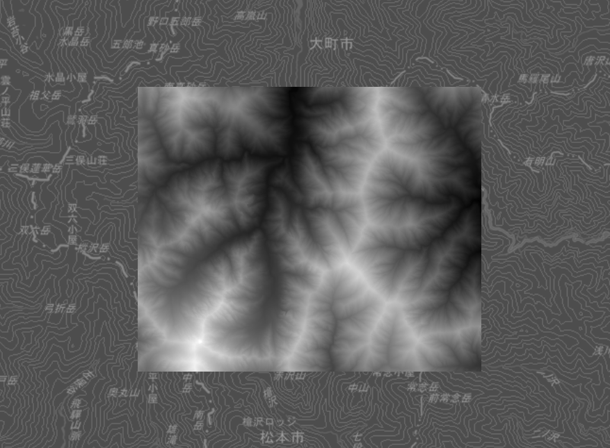
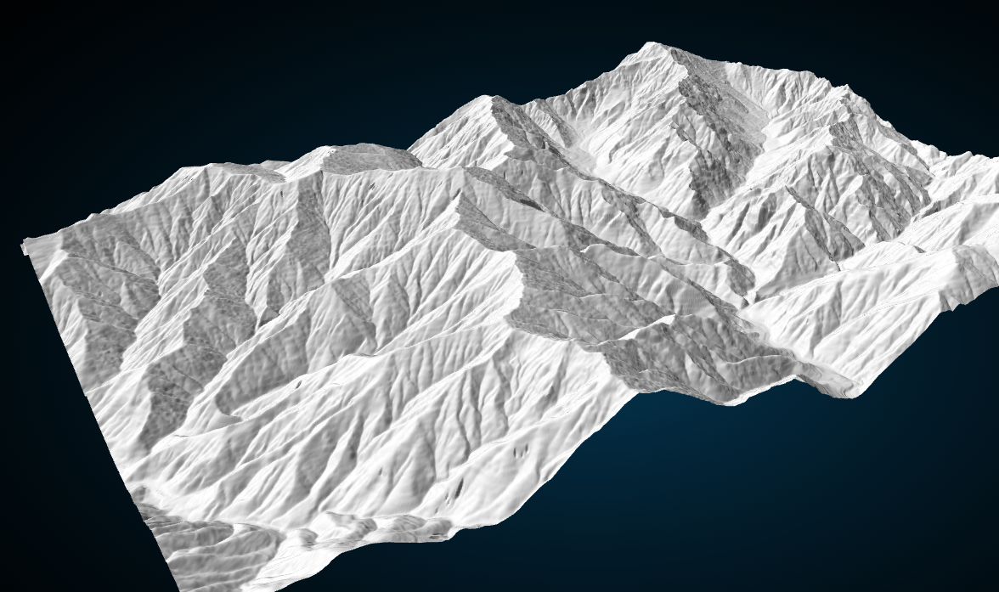

# xml-dem-viewer

基盤地図情報 DEM データ（xml）可視化ツール 🗻

## 概要

このツールは、[基盤地図情報 数値標高モデル(DEM)データ](https://service.gsi.go.jp/kiban/app/map/?search=dem)をブラウザ上で表示するためのものです。DEM データは、地形の標高情報を含む XML フォーマットで提供されており、これを WebGL を使用して可視化します。

xmlデータのパース処理は、QGIS プラグインの「[QuickDEM4JP](https://plugins.qgis.org/plugins/QuickDEM4JP/)」を参考に実装しています

## 機能

- DEM XMLファイルの読み込みと可視化
- MapLibre GL JS による地図表示
- Three.js による3D表示
- GeoTIFFエクスポート機能

## ⚠️ エクスポート機能について

**重要：GeoTIFFエクスポート機能は現在ドラフト段階です**

- 出力されるGeoTIFFファイルのデータ品質は保証されません
- 本格的な地理空間解析や業務利用には適していません
- あくまで実験的・評価目的での使用に留めてください
